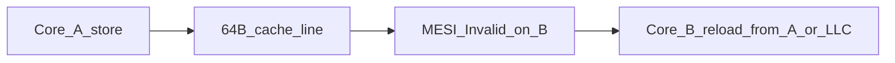

# Cache, false sharing, and layout

The CPU does not load variables. It loads **cache lines** (64 bytes on x86-64). Two threads that write different fields on the same line bounce that line between cores — **false sharing**. That bounce is often the difference between a 3-cycle add and a 50-ns round trip to another L2/L3.

This chapter is the first thing to get solid. Later chapters assume you can look at a struct and say which fields will share a line.

## Mental model



- **True sharing:** two cores actually need the same word (a sequence number both update). Expensive, sometimes unavoidable.
- **False sharing:** two cores touch *different* words that happen to sit on one line. Always a layout bug.
- **Coherence, not DRAM:** the line often never goes to memory. It ping-pongs in caches. `perf stat` LLC misses can stay low while you still lose.

Padding producer/consumer indices onto separate lines is why `hft::SpscRing` (and the NIC rings in [kernel-bypass](../kernel-bypass)) exist in that shape.

## Examples

Build from the series root, Release:

```bash
cmake -S . -B build -DCMAKE_BUILD_TYPE=Release
cmake --build build -j
```

Binaries land under `build/01-cache/` (or `build/01-cache/Release` with Visual Studio).

### 1. False sharing vs padded counters

Two threads increment two `atomic<uint64_t>`s.

```bash
./build/01-cache/false_sharing --iters 50000000 --padded 0 --cpu-a 0 --cpu-b 1
./build/01-cache/false_sharing --iters 50000000 --padded 1 --cpu-a 0 --cpu-b 1
```

`--padded 0` packs the counters on one line. `--padded 1` gives each its own line. Pin onto **two different cores** or the scheduler can serialize the threads and hide the effect. On Windows, `pin_cpu` is a no-op; run this on WSL2/Linux for a clean result.

What you should see: unpadded ns/inc several times padded. The work is identical.

### 2. AoS vs SoA

A book of orders. The hot loop only sums `px`.

```bash
./build/01-cache/aos_vs_soa --n 8000000
```

Array-of-structs pulls `id`, `qty`, `ts` into the cache along with `px`. Struct-of-arrays walks a packed `px[]`. Same arithmetic, fewer lines transferred.

### 3. Sequential vs strided vs random

```bash
./build/01-cache/access_pattern --n 33554432 --stride 1
./build/01-cache/access_pattern --n 33554432 --stride 16
./build/01-cache/access_pattern --n 33554432 --random 1
```

Stride 1: prefetcher and sequential lines. Stride 16 (every 16 `uint64_t` = 128 bytes): every other line, or worse. Random: cache and **TLB** both miss. This is also why huge pages show up in chapter 04.

## Interview talking points

- Why 64, not `sizeof(the field)`?
- Why `alignas(64)` on the *second* index, not a `char pad[56]` after the first (padding after the first is also fine; the invariant is “different lines”).
- What is 4K aliasing? Two addresses 4K apart can fight in L1 if they map to the same set.
- NUMA: a remote line is not “a slower cache miss”; it is another socket’s directory + QPI/UPI round trip.

## Questions to close this chapter

1. Draw the cache lines for the unpadded and padded structs in `false_sharing.cpp`.
2. Run both modes under `perf stat -e cycles,instructions,L1-dcache-load-misses,cache-misses` (chapter 05).
3. Predict `aos_vs_soa` before you run it. Then explain the ratio from bytes moved, not from “SoA is faster.”
