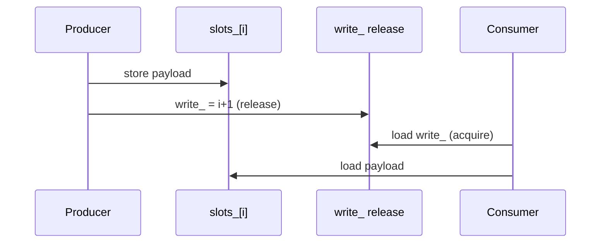

# C++ memory model and SPSC

A data race in C++ is undefined behaviour, not “a torn read on x86.” If thread A writes a `int` and thread B reads it, and there is no happens-before edge, the program is meaningless — even if it “works” on your laptop.

The artefact for this chapter is `hft::SpscRing` in `common/include/hft/spsc_ring.hpp`. The same protocol is what a NIC completion ring is doing in [kernel-bypass](../kernel-bypass).

## The protocol

```
producer:  store slot[i]          // payload
           write_.store(i+1, release)

consumer:  w = write_.load(acquire)
           load slot[i]           // payload is visible
           read_.store(i+1, release)
```



The acquire/release pair is the software analogue of a DMA completion barrier. `relaxed` is legal for the producer’s own `write_` (it is the only writer) and for stats (`size()`).

## x86 will lie to you

x86 TSO does not reorder stores with stores, or loads with loads. A payload store followed by a `relaxed` store to `write_` often still “works” on a workstation. It is still a C++ data race, and it is wrong on ARM. Interviewers care that you know the difference.

The opposite bug is visible everywhere:

```text
write_.store(w + 1, release);   // publish first
slots_[w & mask_] = value;      // then write payload
```

The consumer can pop a slot that has not been written. `message_passing --wrong 1` does this on purpose.

## Examples

```bash
./build/02-memory-model/message_passing --iters 2000000 --wrong 0
./build/02-memory-model/message_passing --iters 2000000 --wrong 1
./build/02-memory-model/store_buffer --iters 1000000 --seqcst 0
./build/02-memory-model/store_buffer --iters 1000000 --seqcst 1
```

### 1. Message passing

Correct order: payload, then release. Consumer acquire, then read. Checksum must match.

Wrong order: increment the index before writing the payload. You will usually see mismatches; if you do not, you got lucky with timing — the program is still wrong.

### 2. Store buffer (Dekker)

Two threads each store their flag then load the other.

```text
x = 1;  r1 = y;
y = 1;  r2 = x;
```

With `relaxed` (plain `MOV` on x86) both can read `0` — each store sits in a store buffer while the load reads the other flag from cache. `seq_cst` stores drain that buffer (`xchg` / fence). Count of `(0,0)` should collapse.

This is why “I’ll use relaxed everywhere, x86 is strong” is not an order book strategy. Independent flags still need a policy.

## What `SpscRing` is not

- Not MPSC. Two producers on `write_` is a data race.
- Not wait-free under contention with a slow consumer: `try_push` returns false and the caller decides (spin, drop, or block). A trading datapath usually **drops or sheds**, and never allocates.
- `size()` is a statistic, not a linearization point for flow control.

## Questions to close this chapter

1. Which loads/stores in `try_push` / `try_pop` can be `relaxed`, and why?
2. Why are `write_` and `read_` on separate cache lines? (Chapter 01.)
3. If `T` were `std::string`, what would break? (Trivially copyable + no alloc in the ring.)
4. Sketch MPSC. Where is the extra atomic, and what does it cost?
