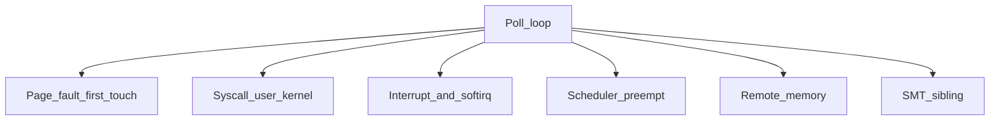

# Linux latency sources

The hot path’s budget is nanoseconds. The kernel is a latency *source*: syscalls, page faults, interrupts, the scheduler, C-states, SMT siblings, and remote NUMA. This chapter is about seeing those costs, not about configuring a production box (that is a runbook: `isolcpus`, IRQ affinity, `nohz_full`, disabled turbo as a policy choice).

Portable parts run on Windows. Pinning, `CLOCK_MONOTONIC_RAW`, and `getppid` need Linux (WSL2 is enough).

## Where the time goes



| Source | Symptom | What you do at setup |
| --- | --- | --- |
| Minor fault | First access to a page is µs, not ns | Touch + `mlock` the pool |
| Syscall | `recvfrom` / `clock_gettime` vs vdso | Batch, busy-poll, or bypass (ch. 07) |
| Scheduler | 50 µs+ holes in a spin loop | Pin, isolate CPU, don’t sleep |
| Interrupts | Random spikes on the pinned core | Move IRQs off the datapath CPU |
| Clock | `gettimeofday` jitter, NTP steps | TSC, `CLOCK_MONOTONIC_RAW` |
| NUMA | Same code, 2–3× slower | `numactl --membind`, first-touch on the right socket |

`epoll` is the right tool for many idle sockets. A trading datapath with one (or a few) feeds **polls**. Sleeping is how you buy jitter.

## Examples

```bash
./build/04-linux-latency/clocks --iters 1000000
./build/04-linux-latency/page_faults --bytes 268435456
./build/04-linux-latency/jitter --samples 200000 --cpu 0
```

### 1. Clocks

Times a tight loop of `rdtsc`, `now_ns()` (`CLOCK_MONOTONIC_RAW` on Linux), and `std::chrono::steady_clock`. Prints ns/call. On Linux also times `getppid()` so you have a syscall in the same units.

`rdtsc` is not nanoseconds. Calibrate: elapsed TSC / elapsed ns over a spin. Use it for *short, same-core* intervals. Do not subtract TSC across cores unless you know the TSC is invariant and you have a serializing instruction when it matters (`rdtscp` / `lfence`).

### 2. Page faults

Allocate a large buffer. Time a write to every 4 KiB page, then the same write again. The first pass pays the kernel; the second is userspace. `--mlock 1` (Linux) pulls pages in up front so the timed loop should look like the second pass.

Huge pages (`MAP_HUGETLB`) cut TLB misses for big working sets — that is the sequel to `access_pattern --random 1` in chapter 01. They need pool setup on the machine; the flag fails cleanly if the pool is empty.

### 3. Jitter

Spin, sample `now_ns()`, record the delta between samples. A clean isolated core gives a tight histogram. Preemption, IRQs, and power-state exits show up as p99/max holes. `--sleep-us N` replaces the spin with `sleep_for` and shows why a datapath does not sleep.

Pin with `--cpu N`. Compare pinned vs unpinned on a busy box.

## Questions to close this chapter

1. Why is `mlock` at startup, not `try { } catch` around the poll loop?
2. Why might `clock_gettime(CLOCK_MONOTONIC_RAW)` be ~20 ns and `getppid` ~300 ns on the same box? (vdso vs syscall)
3. List jitter sources in the order you would hunt them with `perf` and `/proc/interrupts`.
4. When is `SCHED_FIFO` the wrong answer? (You still share the core with IRQs and you can starve the machine.)
