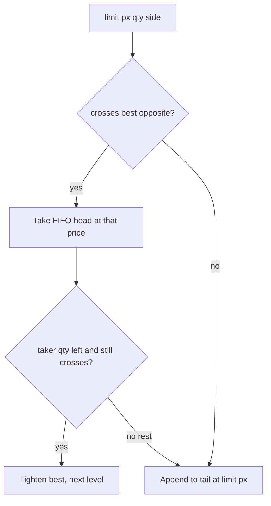

# Limit order book

A matching engine is the domain-shaped version of chapters 01–06: integer ids, a preallocated pool, no `map` on the hot path, and one thread that owns the instrument.

This book is **price-time priority** (FIFO at a price). A buy lifts asks at `best_ask` while `best_ask <= limit_px`. A sell hits bids while `best_bid >= limit_px`. Trades print at the **maker’s** (resting) price.



## Layout

| Piece | Why |
| --- | --- |
| Price as `uint32_t` ticks | Doubles are not equality-safe; symbology becomes an int at session start (ch. 03) |
| `levels[px]` array | O(1) top-of-book and qty-at-price; same idea as `hashmap_vs_array` |
| Order pool, id = index | Cancel is unlink, not a search. No `new` on submit (ch. 03, ch. 06) |
| Intrusive FIFO at a level | Time priority without `deque::erase` |
| Single thread per instrument | Matching is a serialisation point; shard by symbol, not by mutex |

Emptying the best level **scans** toward the other side across the tick range. Cheap if the band is tens of ticks (this chapter). A production sparse book keeps an occupied-level list or a sorted vector of live prices so “next best” is O(1) / O(log n), at the cost of more work on insert.

Out of scope on purpose: stop/iceberg/hidden qty, self-trade prevention, market-by-order vs market-by-level feeds, recoverability. Those sit on top of this kernel.

## Examples

```bash
./build/07-order-book/book_demo
./build/07-order-book/book_bench --n 500000 --px-lo 90 --px-hi 110
./build/07-order-book/book_bench --n 500000 --px-lo 90 --px-hi 110 --stl 0
```

Visual Studio: `build/07-order-book/Release/book_demo.exe`.

### 1. `book_demo`

A handful of submits and a printed ladder. Watch FIFO at 100: the older bid is taken first. Watch a marketable buy trade at the resting ask, not at the taker’s limit.

### 2. `book_bench`

Same random tape against `lob::Book` (ladder) and `lob::StlBook` (`std::map` of `std::deque` + `unordered_map` for cancel). Checksums must match; ns/op should not. `--stl 0` skips the control.

`--cancel-pct` is the chance an op cancels the most recently recorded rest instead of submitting a new limit. Filled makers left on that stack fail cancel and are dropped. `--max-orders` is the pool cap (and the STL live cap).

## Questions to close this chapter

1. Why is the trade price the maker’s price, not the taker’s limit?
2. Why must cancel be O(1) in the id? What does a trader’s session do all day besides new orders?
3. When is `levels[px]` the wrong shape? (Wide futures bands, implied prices, sparse options strikes.)
4. Two threads matching one symbol: what breaks first, cache or correctness?
5. Connect to [kernel-bypass](../kernel-bypass): the book never calls `recvfrom`. A feed thread (or NIC poll) hands it POD orders; execs go out on another SPSC ring (ch. 06 logger shape).
