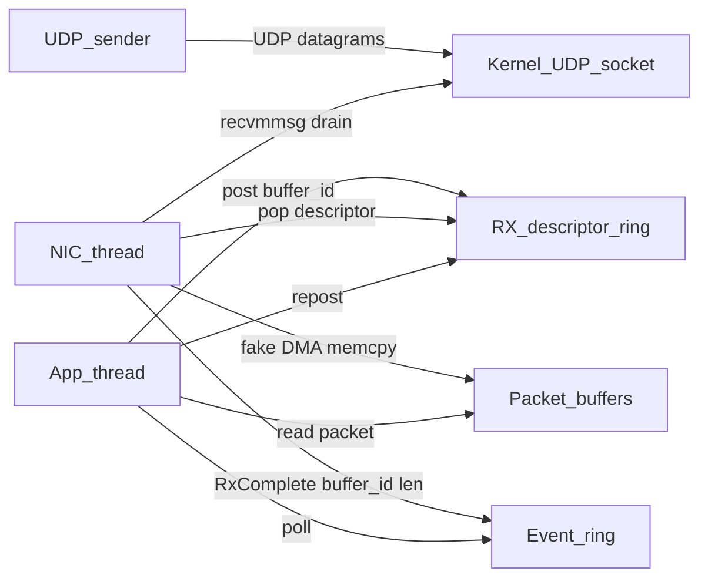

# Kernel bypass: userspace NIC / RX-ring

Chapter 8 of the [HFT Series](../README.md). Earlier chapters cover cache lines, the memory model, Linux jitter, measurement, and a limit book; this one puts those shapes on a receive path.

A model of the **ef_vi / ExaNIC receive path**. A UDP socket stands in for the NIC. The application never calls `recvfrom`. It only **posts** buffers, **polls** completions, and **reposts** — the same ownership loop as `ef_vi_receive_init` / `ef_eventq_poll`.

C++20, CMake. The UDP path (`recvmmsg`) is Linux/WSL. The ownership tests are portable and need no socket.

This still uses the kernel UDP stack on the NIC thread. What is bypassed is the *application* path. The `memcpy` into a posted buffer is **fake DMA**; a real NIC writes that buffer without the CPU.

## Receive path



Two rings, opposite directions:

- **Descriptor ring (app → NIC):** empty buffers the NIC may DMA into.
- **Event ring (NIC → app):** which buffers now hold a packet.

If the app is slower than the sender, the descriptor ring empties and the NIC **drops**. A larger ring absorbs bursts; it does not fix a sustained mismatch.

## Ownership

```
Free  --post/repost-->  Posted  --NIC DMA + complete-->  Filled  --repost-->  Posted
                         NIC owns                         app owns (safe to read)
```

`post` on a buffer that is not `Free`, or `data()` while it is still `Posted`, fails.

## Mapping onto real APIs

| This project | ef_vi | ExaNIC |
| --- | --- | --- |
| `PacketPool` / `dma_address()` | `ef_memreg` (pin + DMA map) | RX buffer mapping |
| `vi.post(id)` | `ef_vi_receive_init` + `ef_vi_receive_push` | give the NIC a receive slot |
| `vi.poll(events, n)` | `ef_eventq_poll` | `exanic_receive_frame` |
| `vi.repost(id)` | `receive_init` again | return the slot |
| `SimulatedNic` memcpy | NIC DMA into registered memory | NIC DMA into RX buffer |
| `rx_overrun` | RX ring overflow / drops | dropped frames when the app does not keep up |

## Build

From the series root:

```bash
cmake -S . -B build -DCMAKE_BUILD_TYPE=Release
cmake --build build -j
ctest --test-dir build --output-on-failure
```

Or this directory alone:

```bash
cmake -S kernel-bypass -B kernel-bypass/build -DCMAKE_BUILD_TYPE=Release
cmake --build kernel-bypass/build -j
```

Binaries land under `build/kernel-bypass/` (or `build/kernel-bypass/Release` with Visual Studio).

## Burst vs sustained drop

Terminal 1 — small ring, slow application (20 µs per packet):

```bash
./build/kernel-bypass/receiver --port 9000 --buffers 64 --slow-us 20 --seconds 15
```

Terminal 2 — short burst, then idle (a 64-deep ring should absorb this):

```bash
./build/kernel-bypass/sender --port 9000 --count 10000 --burst 10000 --idle-ms 200 --payload 64
```

Then a sustained rate the slow app cannot drain (`overrun` climbs):

```bash
./build/kernel-bypass/sender --port 9000 --count 200000 --rate 200000 --payload 64
```

Repeat the receiver with `--buffers 1024` and the same burst: the larger ring absorbs the burst. Under a sustained 200k pps with `--slow-us 20` it still drops — any finite ring fills if produce > consume.

Kernel socket baseline:

```bash
./build/kernel-bypass/baseline_recvfrom --port 9000 --batch 32 --seconds 15
```
